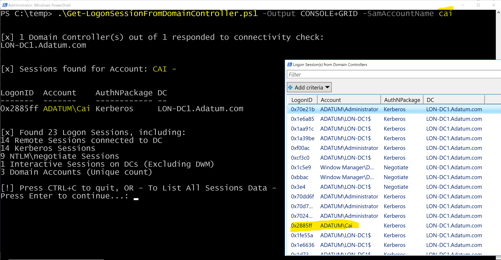
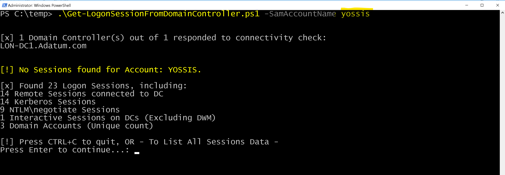
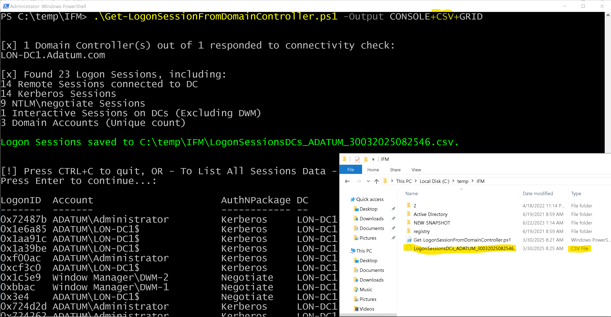

# Get-LogonSessionFromDomainController
Get Logon Sessions from Domain Controllers, providing a quick overview of which accounts recently communicated directly with any DC in an AD domain, via any Authentication protocol or service.

## Get Logon Sessions recently communicating with (any) Domain Controller(s) ##
Provides a quick overview of which accounts recently communicated directly with any DC in an Active Directory domain, via any Authentication protocol or service.  Rather than using eventlog query, or connecting to a SIEM, this script's "quick and fairly clean" approach is to enumerate logon sessions directly from DCs memory. This provides very fast insight to Logon sessions, network or interactive, in the entire domain. It requires of course permissions to run WinRM (just klist.exe) on DCs.  
While not totally accurate, since there's an idle time for the connections, this can provide a real-time snapshot of recently active accounts (recently performed access via SMB, WinRM, RPC etc.)  
By default, queries all Domain Controllers for logon sessions, displaying all authentication packages & logon types.  
If parameter SamAccountName is specified, highlights sessions (if any) for this specific account, user or computer (SamAccountName$).  
Requires permissions to run PSRemoting on Domain Controllers (only runs klist.exe) 

### Parameters ###
#### Output 
Controls if output is to console, csv file, grid, or any of these options. 
Values - "CONSOLE ONLY" (default), "CONSOLE+CSV", "CONSOLE+GRID", "CONSOLE+CSV+GRID"  

#### SamAccountName
If parameter SamAccountName is specified, it highlights sessions (if any) for this specific account, user or computer (SamAccountName$).  

Here's a screenshot of running the script with Console+Grid output option, for a specific user: 

Here's a screenshot of running the script for a specific user, console only: 

Here's a screenshot of running the script with Console+CSV+Grid output option: 

